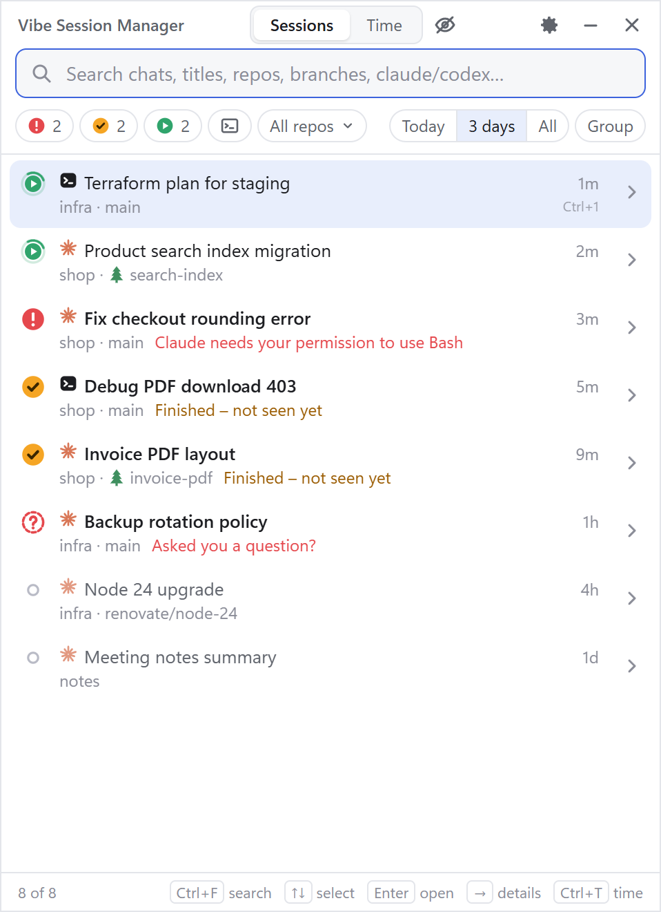
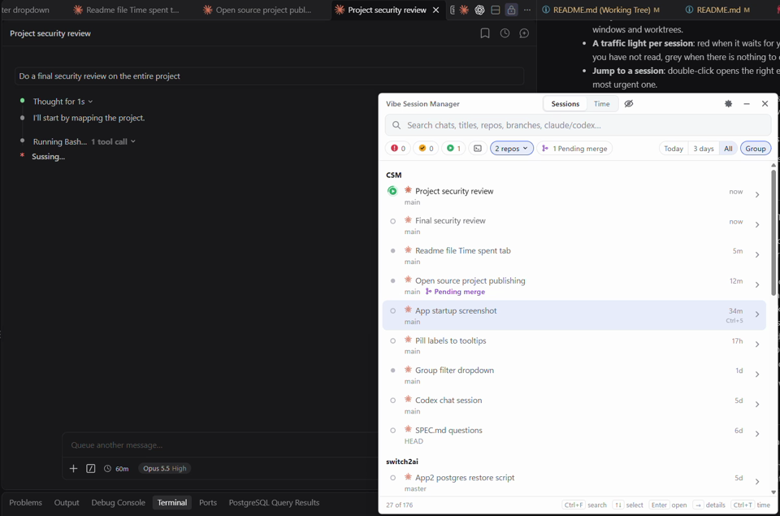

# Vibe Session Manager

[](https://github.com/Ruvan72/vibe-session-manager/actions/workflows/ci.yml)
[](LICENSE)


**One list of every Claude Code and Codex session on your machine: which ones are waiting for you, what each one is about, and a double-click to jump to the right editor window.**

When you run several AI coding agents at once, one per VS Code window or git worktree, it is easy to lose track. Claude Code's own history only shows the sessions of the folder that is open, so a session started in a worktree window cannot be found from the main repo's window. Vibe Session Manager is a small tray app that reads the session files the agents already write and shows them all in one place.

<p align="center">
  <picture>
    <source media="(prefers-color-scheme: dark)" srcset="docs/images/screenshot-dark.png">
    
  </picture>
</p>

## Features

- **Every local session in one list**: Claude Code (VS Code, Cursor, CLI) and OpenAI Codex (app, VS Code extension, CLI), across all windows and worktrees.
- **A traffic light per session**: red when it waits for your permission or answer, green while it works, yellow when it finished a turn you have not read, grey when there is nothing to do.
- **Jump to a session**: double-click opens the right editor window with the session open. `Ctrl+Alt+Enter` goes straight to the most urgent one.
- **Tray badge, notifications and a "blop"** when a session needs you, but not when you are already looking at its window.
- **Search** across titles, repos, branches and the conversations themselves.
- **Labels, rename and hide** to keep the list tidy.
- **Time tracking**: active time per day, repo and session, with CSV export.

<p align="center">
  <a href="docs/images/vibe-session-manager-show-activate-vscode.mp4">
    
  </a>
  <br>
  <em>▶ <a href="docs/images/vibe-session-manager-show-activate-vscode.mp4">Watch the 30-second demo</a>: open the list, pick a session, land in the right VS Code window.</em>
</p>

See [docs/USAGE.md](docs/USAGE.md) for the full guide and all keyboard shortcuts.

## Time spent

The **Time** tab (`Ctrl+T` switches between Sessions and Time) shows how much active time went into your sessions, one day at a time:

- **A total for the day**, then **each repo** with its subtotal, then **each session** with its active periods (for example `08:02–09:15 · 10:30–11:05`). A dot marks sessions that are working right now.
- **Active time comes from the timestamps in the transcripts.** Activity with at most the *idle gap* in between (90 minutes by default, change it in Settings) belongs to one period. A longer pause ends the period and is not counted.
- **Parallel sessions both count**, so a day's total can be longer than the time you sat at the desk.
- **`←` and `→`** switch day, **Today** jumps back, and clicking a session opens it.
- **Copy day as CSV** puts the day on the clipboard, separated by semicolons, with the columns `date`, `repo`, `worktree`, `branch`, `title`, `start`, `end`, `active_minutes`, `periods` and `agent`.
- **Open time folder** shows the stored files: one JSON file per day in `~/.vibe-session-manager/time/`. They keep your time after Claude Code deletes old transcripts, and hidden sessions still count.

Claude Code and Codex sessions are counted the same way.

## Install

Vibe Session Manager runs on **Windows 10 and 11**. macOS and Linux are not supported yet.

1. Download `Vibe-Session-Manager-Setup-<version>.exe` from the [latest release](https://github.com/Ruvan72/vibe-session-manager/releases/latest).
2. Run it. It installs for your user only (no admin rights) and starts the app.
3. The installer is not code-signed yet, so Windows SmartScreen says "Windows protected your PC". Click **More info** → **Run anyway**. To check the download first, compare `Get-FileHash <file>` in PowerShell with `SHA256SUMS.txt` in the release.

There is also a portable `.exe` that needs no install. It unpacks itself on every start, so it starts a few seconds slower.

The app lives in the tray. Press `Ctrl+Alt+Space` to open the list from anywhere, and turn on **Start at login** in Settings.

For reliable red and yellow lights for Claude Code, click **Install hooks** in the banner (see [Privacy](#privacy-and-what-the-app-touches) for what that changes).

## Privacy and what the app touches

Your transcripts can contain anything, so here is exactly what the app does with them:

- **Nothing leaves your machine.** The app makes no network requests, has no telemetry and no auto-update.
- **It reads** `~/.claude` (transcripts and live session status), `~/.codex` (Codex sessions and titles), and VS Code's or Cursor's own `storage.json` to see which folders are open.
- **It writes to only three places outside its own folder, and only when you act:**
  - **Install hooks** adds one hook per event to `~/.claude/settings.json`. Your existing settings and hooks are kept, a backup is saved as `settings.json.vsm-backup`, and **Remove hooks** takes them out again. The hook records session id, event name, time and notification text. It never records prompts.
  - **Rename** appends one `custom-title` line to that session's transcript, exactly as Claude Code's own `/rename` does.
  - **Start at login** adds a Windows login item.
- Its own data (settings, seen marks, labels, time) is in `~/.vibe-session-manager/`.

## Known limitations

- Windows only for now.
- Codex does not write anything to disk while it waits for approval, so a waiting Codex session shows as working (green), not red.
- Jumping to a session relies on `vscode://` links after opening the folder. It has not been tested on every setup; if it opens the wrong window, a companion VS Code extension is planned.
- Sessions started from Claude Desktop or the CLI are not reopened in a terminal yet; the app copies the `claude --resume <id>` command instead.
- The session file formats of Claude Code and Codex are not documented, so an update to either can break parts of the app until it is adapted.

See the [open issues](https://github.com/Ruvan72/vibe-session-manager/issues) for what is planned.

## Build from source

You need [Node.js](https://nodejs.org/) 22.6 or later.

```sh
npm install
npm run dev        # run with hot reload of the UI
npm test
npm run dist       # build the installer and portable .exe in dist/
```

See [CONTRIBUTING.md](CONTRIBUTING.md) for the project layout, demo data and how to send changes.

## Contributing

Bug reports, ideas and pull requests are welcome. Please read [CONTRIBUTING.md](CONTRIBUTING.md) first, and report security problems as described in [SECURITY.md](SECURITY.md).

## License

[MIT](LICENSE) © 2026 Switch2AI

Vibe Session Manager is an independent project. It is not affiliated with, endorsed by or sponsored by Anthropic or OpenAI. Claude and Claude Code are trademarks of Anthropic, PBC. Codex and OpenAI are trademarks of OpenAI.
